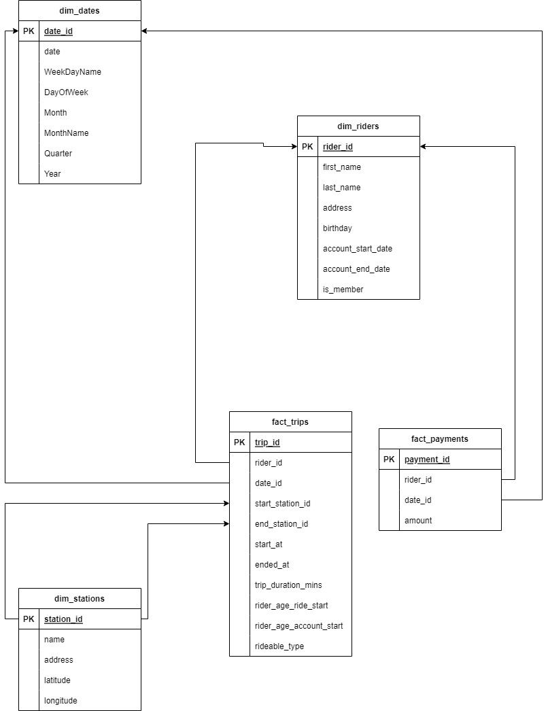
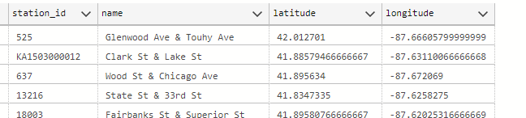
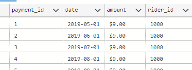
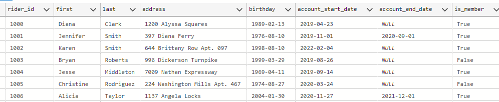
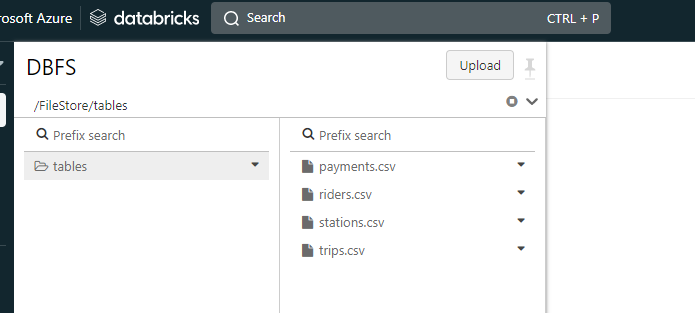

# Building an Azure Data Lake Solution for Bikeshare Data Analytics

Divvy is a bike sharing program in Chicago, Illinois USA that allows riders to purchase a pass at a kiosk or use a mobile application to unlock a bike at stations around the city and use the bike for a specified amount of time. The bikes can be returned to the same station or to another station. The City of Chicago makes the anonymized bike trip data publicly available for projects like this where we can analyze the data.

The goal of this project is to develop a data warehouse solution using Azure Databricks. It involved:

* Designing a star schema based on the business outcomes expected
* Import the data into Azure Databricks using Delta Lake to create a Bronze data store
* Create a gold data store in Delta Lake tables
* Transform the data into the star schema for a Gold data store

## Dataset
The data contains 4 initial tables:
* trip with 4584921 records

* station with 838 records:

* payment with 1946607 records:

* rider with 75000 records:

## Extract and Load
The csv files for the dataset were uploaded to the databricks file system.

The 4 files were loaded into spark dataframes and contents written into delta files. Afterwards, staging tables were created and saved to the delta lake on a new `divvy` schema:  `divvy.staging_trips`, `divvy.staging_payments`, `divvy.staging_riders`,`divvy.staging_stations`. 

## Transform

Transformation was done in line with the entity relationship diagram as guiding architecture. Python notebook `divvy_ELT.ipynb` contains all the code.

## Challenges
1. In order to create a date dimension I adapted the resource [here](https://www.bluegranite.com/blog/generate-a-calendar-dimension-in-spark) by Chris Koester.
